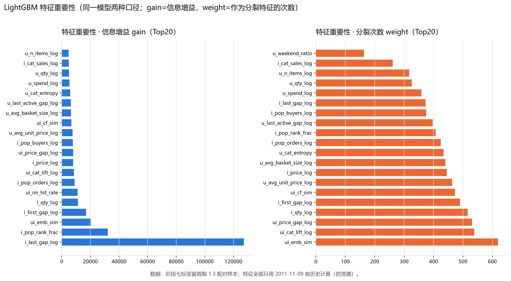

# 阶段七 · 多维度特征挖掘与 LightGBM 特征重要性（报告素材）

> 任务：① 设计并实现多维度特征（用户/商品/统计/交互等 ≥4 类）；② 工程化拼接为以 user_id、item_id 开头的全数值宽表 CSV；③ 以标签窗首购为正样本训练 LightGBM 二分类，输出特征重要性排序表与 Top-5 特征业务解读。

## 一、时间口径与防泄漏设计

把数据切成一个**特征期**与一个**标签窗**，两者用锚点 `FEAT_CUT = 2011-11-09` 严格分开：

- **特征期**：`InvoiceDate < 2011-11-09`，本阶段全部 31 个特征只用这一段历史计算，共 331,431 行交易 / 15,733 张订单 / 4,067 个用户 / 3,624 种商品。
- **标签窗**：尾随 30 天 `[2011-11-09, 2011-12-09]`（数据止于 12-09），共 66,453 行交易、1,667 个用户在此期间有购买。
- 防泄漏红线：任何行为型特征（用户活跃度、商品热度、首现/近售时间、向量、共同购买画像）一律只用特征期数据；复用的商品向量不是线上全量模型，而是**只在特征期订单篮上重训**的 Skip-gram 向量（`vectors_feat_skip.npz`）。类目/国家为静态属性表，可直接使用。

## 二、样本与标签构造

- 候选用户：特征期订单数 ≥ 2 的用户（共 2,518 人）。
- 正样本：候选用户在**标签窗内的首次购买**——即该商品不在其标签窗前的购买史中。
- 负样本：配对采样 1:3——对每个正样本，从该用户「全数据集从未购买 ∩ 特征期有销量的商品目录」中不放回随机抽 3 个（seed=42，可复现）。

| 统计量 | 数值 |
| --- | --- |
| 候选用户（特征期≥2 单） | 2,518 |
| 进入样本的用户（至少 1 个首购正样本） | 1,033 |
| 正样本（标签窗首购） | 21,159 |
| 负样本（1:3 配对采样） | 63,477 |
| 宽表总行数 | 84,636 |
| 实际正:负 | 1 : 3.0 |
| 冷启动正样本（特征期无销量的商品） | 462（占正样本 2.18%，此类商品特征按真实冷启动置 0） |

## 三、全数值特征宽表

宽表 `feature_wide.csv`：84,636 行 × 34 列，首列 `user_id`（int64 原值）、次列 `item_id`（StockCode 经 `id_map.csv` 排序映射为数值 0..3656），随后 31 个数值特征（float64），末列 `label`（0/1）。**全部字段均为数值类型**：城市（国家）用 one-hot、类目用收拢后销售额排名编号，星期用峰值星期编号。`verify_wide()` 自检结论：dtypes 全数值、无 NaN、列序正确、item_id 均在 id_map。

| 字段 | 说明 |
| --- | --- |
| user_id | 用户 CustomerID（int64 原值） |
| item_id | 商品数值编号（StockCode→int，共 3,657 个，见 id_map.csv） |
| 特征列 ×31 | 见第二节特征清单（分组 A 用户 10 / B 商品·统计 10 / C 交互 5 / D 文本编码 6） |
| label | 1=标签窗首购（正样本）；0=配对负样本 |

商品类目收拢（长尾 23 类 → 头部桶 + 「其他」）：

| code | 收拢类目 | 特征期销售额占比 |
| --- | --- | --- |
| 0 | 家居装饰 | 21.08% |
| 1 | 厨房用品 | 19.71% |
| 2 | 生活用品 | 11.83% |
| 3 | 装饰品 | 10.12% |
| 4 | 其他 | 9.88% |
| 5 | 派对用品 | 8.97% |
| 6 | 购物袋 | 8.02% |
| 7 | 收纳用品 | 7.40% |
| 8 | 手工用品 | 2.73% |
| 9 | 园艺用品 | 0.27% |

## 四、特征清单（31 个，多维度）

分组：**A 用户画像(10)** · **B 商品·统计·时间(10)** · **C 用户×商品交互(5)** · **D 文本→数值编码(6)**；生成逻辑全部只在特征期内计算。

| # | 特征名 | 属组 | 含义 | 生成逻辑 |
| --- | --- | --- | --- | --- |
| 1 | `u_n_orders_log` | A 用户画像 | 用户历史订单数(log1p) | 特征期该用户去重订单数 log1p |
| 2 | `u_n_items_log` | A 用户画像 | 用户历史去重购买商品数(log1p) | 特征期该用户去重购买商品种数 log1p |
| 3 | `u_qty_log` | A 用户画像 | 用户历史总购买件数(log1p) | 特征期该用户购买总件数（Quantity 求和）log1p |
| 4 | `u_spend_log` | A 用户画像 | 用户历史总消费金额(log1p) | 特征期该用户总消费（Quantity×UnitPrice 求和）log1p |
| 5 | `u_avg_unit_price_log` | A 用户画像 | 用户历史自购商品均价(log1p) | 总消费 / 总件数 → 自购均价 log1p |
| 6 | `u_avg_basket_size_log` | A 用户画像 | 用户平均每单商品种数(log1p) | 每张订单去重商品种数按用户求均值 → log1p |
| 7 | `u_active_days_log` | A 用户画像 | 用户历史活跃购买天数(log1p) | 特征期有购买的日历天数 nunique → log1p |
| 8 | `u_last_active_gap_log` | A 用户画像 | 距切窗最近一次购买间隔天数(log1p，0=非常近) | FEAT_CUT − 特征期最近一次购买时间，天数差 log1p（0=距切窗不足1日） |
| 9 | `u_weekend_ratio` | A 用户画像 | 用户周末下单占比(0~1) | 周末（周六/日）订单数 ÷ 订单总数 |
| 10 | `u_cat_entropy` | A 用户画像 | 用户购买类目集中度熵(归一化) | 用户去重购买商品落在各收拢类目上的份额熵 ÷ ln(触及类目数) |
| 11 | `i_pop_buyers_log` | B 商品·统计·时间 | 商品热度：特征期购买用户数(log1p) | 特征期购买该商品的用户数（买家数）log1p |
| 12 | `i_pop_orders_log` | B 商品·统计·时间 | 商品特征期被购订单数(log1p) | 特征期含该商品的订单数 log1p |
| 13 | `i_qty_log` | B 商品·统计·时间 | 商品特征期总销量(log1p) | 特征期该商品销量（Quantity 求和）log1p |
| 14 | `i_price_log` | B 商品·统计·时间 | 商品特征期单价中位数(log1p) | 特征期该商品 UnitPrice 中位数 log1p |
| 15 | `i_pop_rank_frac` | B 商品·统计·时间 | 商品热门排名位置(0=最热→1=最冷) | 按买家数降序排名 0=最热 … 1=最冷（÷(商品数-1)） |
| 16 | `i_first_gap_log` | B 商品·统计·时间 | 商品上架时间：首销距今间隔(log1p，值大=老品) | FEAT_CUT − 该商品特征期首次销售时间天数差 log1p（值大=老品） |
| 17 | `i_last_gap_log` | B 商品·统计·时间 | 商品滞销程度：最近销售距今间隔(log1p，值大=久未售) | FEAT_CUT − 该商品特征期最近销售时间天数差 log1p（值大=久未售/滞销） |
| 18 | `i_cat_sales_log` | B 商品·统计·时间 | 所属类目特征期销售额(log1p) | 该商品收拢类目在特征期的总销售额 log1p |
| 19 | `i_cat_sales_share` | B 商品·统计·时间 | 所属类目特征期销售额占比(0~1) | 该收拢类目销售额 ÷ 特征期总销售额 |
| 20 | `i_top_weekday_code` | B 商品·统计·时间 | 商品销量峰值星期(0=周一~6=周日) | 该商品特征期销量最大的星期（周一=0 … 周日=6，冷商品补 0） |
| 21 | `ui_cat_lift_log` | C 用户×商品交互 | 用户对该类目的偏好提升比 log1p(用户类目份额/全局份额) | log1p(用户在该类目消费份额 ÷ 该类目全局份额)；无该类目消费=0 |
| 22 | `ui_price_gap_log` | C 用户×商品交互 | 商品价位 − 用户自购均价（对数差，带符号） | log1p(商品价中位数) − log1p(用户自购均价)，带符号；冷商品(无价)=0 |
| 23 | `ui_emb_sim` | C 用户×商品交互 | 与用户历史购买向量的余弦（特征期重训向量） | 特征期重训 Skip-gram 向量：用户已购商品向量均值 与 候选商品向量的余弦 |
| 24 | `ui_cf_sim` | C 用户×商品交互 | 与用户已购集合的 ItemCF 聚合余弦（共同购买者画像） | 候选商品「共同购买者画像」与用户已购集合画像的点积（ItemCF 聚合余弦） |
| 25 | `ui_nn_hit_rate` | C 用户×商品交互 | 商品向量近邻中被用户买过的占比(0~1) | 候选商品向量 Top20 近邻中，被该用户买过的占比（近邻同购信号） |
| 26 | `country_uk` | D 文本→数值编码 | 国家=英国 one-hot | 用户特征期常购国=United Kingdom 记 1，否则 0 |
| 27 | `country_de` | D 文本→数值编码 | 国家=德国 one-hot | 用户特征期常购国=Germany 记 1，否则 0 |
| 28 | `country_fr` | D 文本→数值编码 | 国家=法国 one-hot | 用户特征期常购国=France 记 1，否则 0 |
| 29 | `country_eire` | D 文本→数值编码 | 国家=爱尔兰(EIRE) one-hot | 用户特征期常购国=EIRE（爱尔兰）记 1，否则 0 |
| 30 | `country_other` | D 文本→数值编码 | 国家=其它 one-hot | 以上四国之外（含少量非英国家）记 1，否则 0 |
| 31 | `cat_code_ordinal` | D 文本→数值编码 | 收拢后类目编码(按销售额降序 0=头部~9=长尾/其它) | 候选商品收拢类目按销售额降序的编号（0=份额最高桶…9）；无类目=其他桶 |

## 五、LightGBM 训练

- 切分：**用户级随机 70/30**（seed=42，整用户成组，避免同一用户的行跨训练/验证集泄漏）。
- 标签在同一时间窗内，故不做时间切分，改用用户级切分评估泛化。
- 参数：`{"n_estimators": 300.0, "learning_rate": 0.1, "num_leaves": 31.0, "min_child_samples": 20.0, "subsample": 0.8, "colsample_bytree": 0.8, "random_state": 42.0, "verbosity": -1.0}`，`scale_pos_weight` = 训练集负/正比。
- 验证集指标：**valid AUC = 0.8544**（fit 723 / valid 310 用户）。

## 六、特征重要性排序

重要性取两种口径：**gain**（该特征作为分裂点的信息增益合计，越大说明对判别贡献越大）与 **weight**（该特征被选为分裂特征的次数）。下表按 gain 降序，附正/负样本上的特征均值便于看方向。

| rank | 特征 | 中文含义 | gain | weight | 正样本均值 | 负样本均值 |
| --- | --- | --- | --- | --- | --- | --- |
| 1 | `i_last_gap_log` | 商品滞销程度：最近销售距今间隔(log1p，值大=久未售) | 127248 | 373 | 0.4487 | 2.1753 |
| 2 | `i_pop_rank_frac` | 商品热门排名位置(0=最热→1=最冷) | 32207 | 407 | 0.2499 | 0.5194 |
| 3 | `ui_emb_sim` | 与用户历史购买向量的余弦（特征期重训向量） | 20408 | 619 | 0.2130 | 0.1691 |
| 4 | `i_first_gap_log` | 商品上架时间：首销距今间隔(log1p，值大=老品) | 16981 | 490 | 5.1640 | 5.5356 |
| 5 | `i_qty_log` | 商品特征期总销量(log1p) | 11285 | 516 | 6.9111 | 5.3636 |
| 6 | `ui_nn_hit_rate` | 商品向量近邻中被用户买过的占比(0~1) | 10947 | 158 | 0.0558 | 0.0202 |
| 7 | `i_pop_orders_log` | 商品特征期被购订单数(log1p) | 8950 | 425 | 4.6545 | 3.4660 |
| 8 | `ui_cat_lift_log` | 用户对该类目的偏好提升比 log1p(用户类目份额/全局份额) | 8469 | 538 | 0.7249 | 0.6470 |
| 9 | `i_price_log` | 商品特征期单价中位数(log1p) | 8024 | 445 | 1.0792 | 1.1870 |
| 10 | `ui_price_gap_log` | 商品价位 − 用户自购均价（对数差，带符号） | 7915 | 531 | 0.0841 | 0.1699 |
| 11 | `i_pop_buyers_log` | 商品热度：特征期购买用户数(log1p) | 7668 | 375 | 4.4319 | 3.2909 |
| 12 | `u_avg_unit_price_log` | 用户历史自购商品均价(log1p) | 7536 | 463 | 1.0170 | 1.0170 |
| 13 | `ui_cf_sim` | 与用户已购集合的 ItemCF 聚合余弦（共同购买者画像） | 6761 | 473 | 13.0723 | 8.6101 |
| 14 | `u_avg_basket_size_log` | 用户平均每单商品种数(log1p) | 6377 | 440 | 3.3195 | 3.3195 |
| 15 | `u_last_active_gap_log` | 距切窗最近一次购买间隔天数(log1p，0=非常近) | 6246 | 397 | 3.1215 | 3.1215 |
| 16 | `u_cat_entropy` | 用户购买类目集中度熵(归一化) | 5832 | 434 | 0.8919 | 0.8919 |
| 17 | `u_spend_log` | 用户历史总消费金额(log1p) | 5356 | 359 | 7.4979 | 7.4979 |
| 18 | `u_qty_log` | 用户历史总购买件数(log1p) | 5010 | 326 | 6.9542 | 6.9542 |
| 19 | `i_cat_sales_log` | 所属类目特征期销售额(log1p) | 4929 | 261 | 13.6437 | 13.7335 |
| 20 | `u_n_items_log` | 用户历史去重购买商品数(log1p) | 4811 | 317 | 4.7030 | 4.7030 |
| 21 | `u_weekend_ratio` | 用户周末下单占比(0~1) | 2005 | 164 | 0.1552 | 0.1552 |
| 22 | `i_top_weekday_code` | 商品销量峰值星期(0=周一~6=周日) | 1948 | 141 | 2.2621 | 2.3295 |
| 23 | `u_n_orders_log` | 用户历史订单数(log1p) | 1616 | 113 | 1.9253 | 1.9253 |
| 24 | `u_active_days_log` | 用户历史活跃购买天数(log1p) | 1373 | 104 | 1.8445 | 1.8445 |
| 25 | `i_cat_sales_share` | 所属类目特征期销售额占比(0~1) | 683 | 50 | 0.1261 | 0.1363 |
| 26 | `cat_code_ordinal` | 收拢后类目编码(按销售额降序 0=头部~9=长尾/其它) | 494 | 31 | 3.0468 | 2.6247 |
| 27 | `country_uk` | 国家=英国 one-hot | 259 | 16 | 0.9184 | 0.9184 |
| 28 | `country_fr` | 国家=法国 one-hot | 255 | 21 | 0.0250 | 0.0250 |
| 29 | `country_de` | 国家=德国 one-hot | 86 | 8 | 0.0235 | 0.0235 |
| 30 | `country_other` | 国家=其它 one-hot | 42 | 5 | 0.0240 | 0.0240 |
| 31 | `country_eire` | 国家=爱尔兰(EIRE) one-hot | 0 | 0 | 0.0092 | 0.0092 |

> 说明：纯用户类特征（u_*）在配对 1:3 采样下，每个用户的样本中正/负行各带固定倍数，故其正负均值天然相同；这类特征的判别力体现在跨用户的分布差异，重要性仍以 gain / weight 排序为准。交互与商品类特征（ui_*/i_*）均值差异即可直接读出方向。



## 七、Top-5 特征业务解读

### ① rank 1 · `i_last_gap_log`（商品滞销程度：最近销售距今间隔(log1p，值大=久未售)）
该特征度量商品最近一次售出距切窗的时间，值小=近期有动销。 正样本均值 0.449 明显低于负样本均值 2.175（相对差 -79%），说明该特征对“是否会首购该商品”有强区分力。业务上：i_last_gap_log 取值越低，用户首购该商品的可能性越大；可作为召回/排序阶段加权的候选维度，也可按此做分桶运营策略。

### ① rank 2 · `i_pop_rank_frac`（商品热门排名位置(0=最热→1=最冷)）
该特征度量商品的相对热门名次，0=最热、越接近 1 越冷门。 正样本均值 0.250 明显低于负样本均值 0.519（相对差 -52%），说明该特征对“是否会首购该商品”有强区分力。业务上：i_pop_rank_frac 取值越低，用户首购该商品的可能性越大；可作为召回/排序阶段加权的候选维度，也可按此做分桶运营策略。

### ① rank 3 · `ui_emb_sim`（与用户历史购买向量的余弦（特征期重训向量））
该特征衡量候选商品与用户历史购买向量在语义嵌入空间中的接近程度。 正样本均值 0.213 明显高于负样本均值 0.169（相对差 +26%），说明该特征对“是否会首购该商品”有强区分力。业务上：ui_emb_sim 取值越高，用户首购该商品的可能性越大；可作为召回/排序阶段加权的候选维度，也可按此做分桶运营策略。

### ① rank 4 · `i_first_gap_log`（商品上架时间：首销距今间隔(log1p，值大=老品)）
该特征反映商品在目录中已存在的时间（老品/新品）。 正样本均值 5.164 明显低于负样本均值 5.536（相对差 -7%），说明该特征对“是否会首购该商品”有强区分力。业务上：i_first_gap_log 取值越低，用户首购该商品的可能性越大；可作为召回/排序阶段加权的候选维度，也可按此做分桶运营策略。

### ① rank 5 · `i_qty_log`（商品特征期总销量(log1p)）
`i_qty_log` 是样本判别中信息增益最高的特征之一。 正样本均值 6.911 明显高于负样本均值 5.364（相对差 +29%），说明该特征对“是否会首购该商品”有强区分力。业务上：i_qty_log 取值越高，用户首购该商品的可能性越大；可作为召回/排序阶段加权的候选维度，也可按此做分桶运营策略。

## 八、复现命令

```text
venv\Scripts\python.exe scripts\16_train_feature_lgb.py   # 宽表缺失自动先跑 15
venv\Scripts\python.exe scripts\17_build_feature_docx.py  # md → Word 报告素材
```
