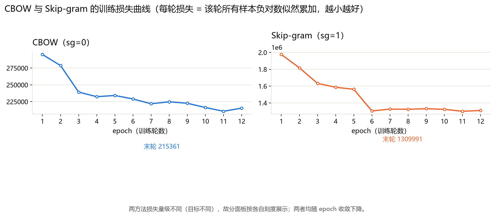
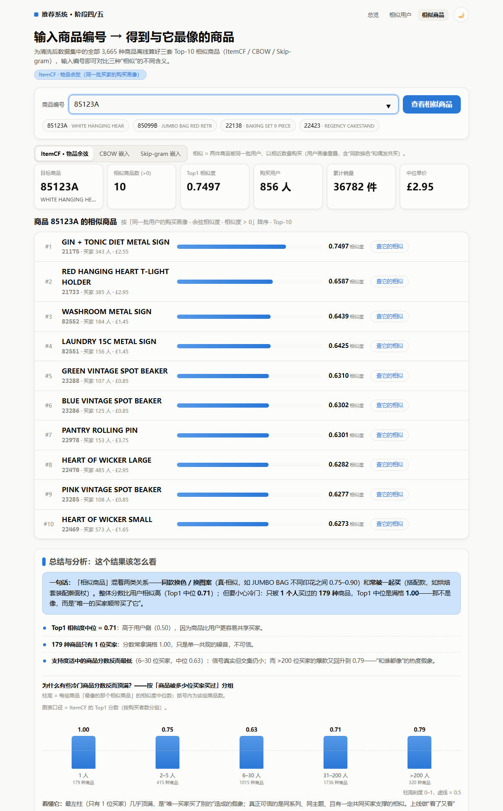
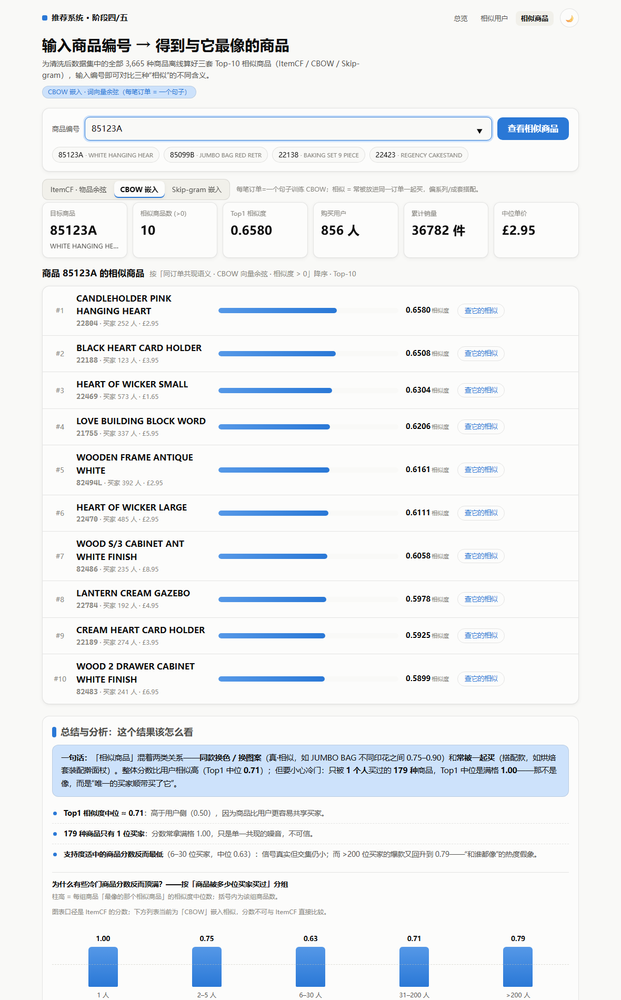
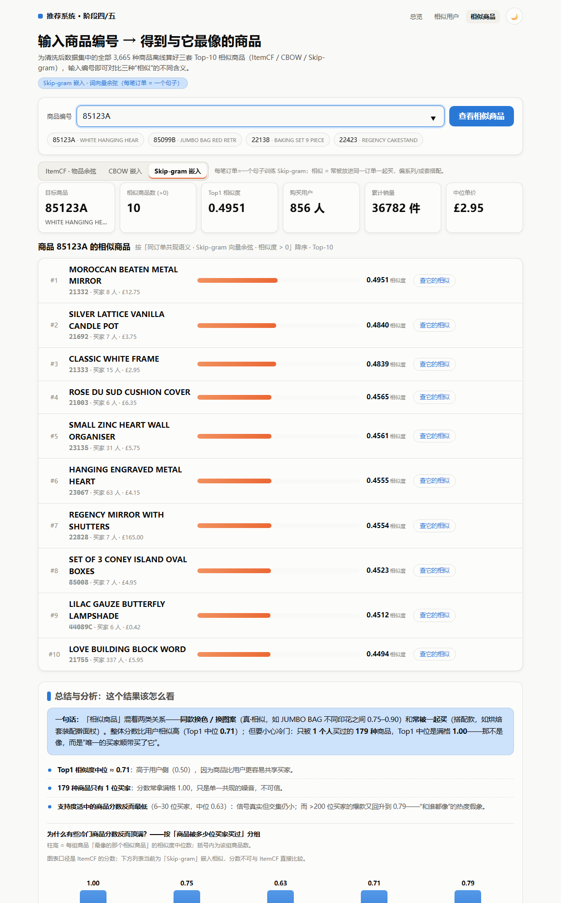

# 阶段五 · 用 CBOW 与 Skip-gram 训练商品序列向量（Item2Vec）——文字素材

> 作用：这是给 Word 文档用的一份可直接复制、改写、插图的素材底稿。
> 全部数字由本机真实跑出，可复现（复现命令见文末）。
> 关键图片：①训练损失曲线 ②相似商品推荐网页三口径截图 ③（可选）离线对比表截图。

## 〇、方法与数据概览

- 数据：清洗后交易 397,884 行、18,532 张订单、3,665 种商品（Online Retail 批发数据集）。
- 语料语义（购物篮视角）：**每一笔订单（InvoiceNo）= 一个句子**，句子的“词”= 该订单内去重后的商品 StockCode。篮内先后顺序本无意义，故训练前用固定随机种子(42)把每个篮内部顺序打乱一次，消除原始行序带来的位置偏差。
- 有效语料：**17,125 个订单篮**（含 ≥2 种商品），平均每篮 22.6 种商品。
- 分别训练两个模型，仅 `sg` 不同：**CBOW（sg=0）**——用篮内其它商品（上下文）的平均预测中心商品；**Skip-gram（sg=1）**——用中心商品预测其周边上下文商品。都只用「同一订单共同出现」的正样本。
- 词表大小：`min_count=5` 过滤后 **3,177**（占全商品 87%）。
- 工具：`gensim` 4.4（Word2Vec），脚本 `scripts/06_train_item2vec.py`（训练）、`scripts/07_build_embed_web.py`（算相似商品/写网页数据）、`scripts/08_evaluate_item2vec.py`（与协同过滤同协议对比）。

---

## 一、用到的各种超参数及其说明

训练脚本 `scripts/06_train_item2vec.py` 与 `config/settings.py` 的 `HYPERPARAMS["item2vec"]` 保持一致；CBOW 与 Skip-gram 除 `sg` 外共用同一组：

| 超参数 | 取值 | 说明 / 为什么这样选 |
|---|---|---|
| `vector_size` | 128 | 每个商品的稠密向量维数。对约 3.2k 词表的购物篮语料 128 维足以表达“同篮共现”关系；太小(<32)信息不足，太大(>256)在该规模下容易过拟合共现噪音。 |
| `window` | 8 | 上下文窗口半径。篮子不是文本，我们把篮内顺序随机化后，每轮每个中心商品随机取半径 1~8（gensim 的 shrink_windows）的商品作上下文；窗口越大越接近“全篮任意两两共现”，越小越稳定。取 8 使一个典型的中等篮（中位 15 种商品）里多数商品对都能进入窗口。 |
| `min_count` | 5 | 词表门槛：至少出现在 5 个订单里的商品才保留，共保留 3,177 种。低于阈值的商品既不做中心也不做上下文——它们是“冷启动”项，网页端嵌入方法会明确提示无向量（见截图/口径说明）。 |
| `epochs` | 12 | 全量语料遍历 12 遍。损失曲线显示约第 6~8 轮后进入平台期，12 轮足够收敛且不过拟合。 |
| `negative` | 5 | 每个正样本（中心-上下文对）配 5 个随机负样本（详见“负样本设计”一节）。 |
| `sample` | 0.001 | 高频词下采样阈值。出现频率很高的“服务型”伪商品（如 POSTAGE、银行手续费行等）会被以 √(t/f) 的概率随机丢弃一部分，避免它们把向量带偏。 |
| `sg` | 0 / 1 | 0=CBOW，1=Skip-gram。本任务各训一个做对比。 |
| `hs` | 0 | 关闭层次 softmax，只用负采样（也是 gensim 对大数据更快、更稳的默认做法）。 |
| `alpha` → `min_alpha` | 0.025 → 0.0001 | 学习率在 12 轮内线性退火到 0.0001。 |
| `workers` | 4 | 并行训练线程数。 |
| `seed` | 42 | 复现种子（项目统一规定 SEED=42）。 |

---

## 二、训练如何设计负样本（负采样）

- 正样本：同一订单里出现的**任意（中心商品，上下文商品）对**。CBOW 与 Skip-gram 的正样本都来自“一起被买进同一张订单”，即**共同购买（co-occurrence）信号**。
- 负样本：对每个正样本，从整个商品库**随机抽取 5 个“不在该订单里”的商品**作为反例（`negative=5`）。
- 抽样分布不是均匀随机，而是 **噪声分布 P(w) ∝ f(w)^0.75**（f = 商品在语料中的出现频率，0.75 次幂是 Word2Vec 的标准做法）：
  - 好处 1：高频但无信息的词（POSTAGE 等）不会频繁地当负样本霸榜；
  - 好处 2：中低频商品也有机会被抽中当负样本，让模型对它们“长记性”。
- 训练目标（直觉版）：对每个正样本把 sigmoid(中心·上下文) 拉向 1，对 5 个负样本把 sigmoid(中心·负样本) 拉向 0。等价于最大化“真共现被识别、随机对不被误认”的似然。
- 它带来的作用：防止所有商品的向量在训练中互相挤成一团，也让模型学会“哪些商品该更像、哪些该更不像”。
- 工程实现：gensim `Word2Vec(hs=0, negative=5, sample=1e-3)`，负样本由 gensim 内部按上述分布采样；逐轮训练损失通过 `compute_loss=True` + 每轮回调记录（数值 = 该轮全部样本的负对数似然累加）。

---

## 三、训练损失过程图（重要）

图片文件：`outputs/item2vec/loss_curve.png`（请插入 Word，可双击打开原图）

- 左图 CBOW、右图 Skip-gram；两面板**各自刻度**（两种方法目标函数与损失量级不同：CBOW 损失是按“预测中心词”的次数累加，Skip-gram 是按“预测每一个上下文词”的次数累加，绝对值不可直接比）。
- 逐轮损失（= 该轮全量样本的负对数似然累加，越小越好）：

| epoch | CBOW 损失 | Skip-gram 损失 |
|---|---|---|
| 1 | 295,213 | 1,975,402 |
| 2 | 278,748 | 1,816,354 |
| 3 | 239,193 | 1,631,968 |
| 4 | 232,398 | 1,585,839 |
| 5 | 234,205 | 1,561,936 |
| 6 | 229,005 | 1,304,464 |
| 7 | 221,875 | 1,326,444 |
| 8 | 224,760 | 1,324,565 |
| 9 | 222,598 | 1,331,166 |
| 10 | 216,247 | 1,323,758 |
| 11 | 210,661 | 1,300,465 |
| 12 | 215,361 | 1,309,991 |

- 观察：
  - 两者**前 3 轮快速下降**（CBOW −19%，Skip-gram −17%），之后进入平台期并伴随小波动（负采样的随机性所致），收敛于 CBOW ≈ 2.15e5、Skip-gram ≈ 1.31e6。
  - CBOW 总降幅约 **27%**、Skip-gram 约 **34%**；Skip-gram 每轮波动更大、但整体降幅略多，二者在第 12 轮都已稳定（末轮与第 11 轮几乎持平）。
- 完整数据存于 `outputs/item2vec/loss_by_epoch.csv`。

---

## 四、web 中相似商品推荐截图

相似商品页新增了右上角 **“ItemCF · 物品余弦 / CBOW 嵌入 / Skip-gram 嵌入”** 三段切换（查询示例：商品 85123A WHITE HANGING HEART T-LIGHT HOLDER）。三张图分别对应三种口径，请插入 Word：

1. ItemCF（同一批买家的购买画像 · 余弦）：
   `outputs/item2vec/shots/web_similar_itemcf.png`

   

2. CBOW 嵌入（同订单共现语义 · 向量余弦）：
   `outputs/item2vec/shots/web_similar_cbow.png`

   

3. Skip-gram 嵌入：
   `outputs/item2vec/shots/web_similar_skipgram.png`

   

三张图结构一致（KPI 卡片 + Top-10 列表 + 相似度条），只有中间列表的口径/分值不同，正适合并排说明“不同相似定义给出不同邻居”。网页可双击离线打开（数据文件在 `web/data/`），也可用网址直达：`similar_items.html?code=85123A&m=cbow`。

---

## 五、主观评价：CBOW 与 Skip-gram 两种方法效果如何、如何对比

### 5.1 观感：嵌入邻居主题成套一致；ItemCF 邻居则混入大量“同批买家”的无关小商品

以 22423 REGENCY CAKESTAND 3 TIER（三层英式蛋糕架，881 位买家）为例，Top-5 邻居（真实描述）：

| 方法 | Top-5 相似商品（StockCode，相似度） |
|---|---|
| ItemCF | 23509 迷你扑克牌(0.70) · 23382 圣诞蛋糕装饰 6 件(0.70) · 71459 果酱瓶吊式灯座(0.70) · 84952B 爱情鸟灯座(0.69) —— **同批买家的其它小商品**，跨主题、解释性弱 |
| CBOW | 22698 粉玫瑰杯碟(0.80) · 22699 玫瑰杯碟(0.76) · 23175 粉奶壶(0.73) · 22697 绿杯碟(0.73) · 23173 玫瑰茶壶(0.73) —— **Regency 全套茶具** |
| Skip-gram | 22698 粉杯碟(0.51) · 23253 16 件餐具组(0.50) · 23172 粉茶盘(0.49) · 23175 粉奶壶(0.49) · 84711B 粉椭圆饰品盒(0.49) —— 同系列茶具为主，略松散 |

即：ItemCF 的“相似”来自**同一批买家的采购画像**（画像里的跨主题噪声被带进相似度），在本批发数据上常表现为**跨主题邻居**（蛋糕架 → 扑克牌 / 灯座）；两种嵌入的“相似”来自**同一张订单里成套购买（共现）**，邻居主题一致性强得多——蛋糕架会拉出整套 Regency 茶具，暖手宝会拉出其它暖手宝。就“搭配 / 看了又看”的可解释性而言，嵌入优于 ItemCF；且嵌入分值不会出现 ItemCF 那种“只有 1~2 位买家→相似度满格 1.00”的假象（见 5.2 的分值对比）。

### 5.2 CBOW 与 Skip-gram 的区别（在本数据上的实测）

- 分值量级：**CBOW 的 Top1 相似度中位 0.920**，邻居普遍 0.8~0.95；**Skip-gram 的 Top1 中位 0.677**，邻居多在 0.45~0.65。CBOW 向量是把上下文“平均”后预测出来的，向量更平滑、彼此更容易高度一致；Skip-gram 每次只更新中心词向量与一个上下文/负样本，向量更“个性”、相似度分布更拉开。
- 一致性：两种方法 Top1 完全一致的商品占 **26.7%**；Top-10 列表重叠中位 Jaccard = **0.176**（中度相关——邻居基本是同一拨“成套商品”，只是排序与分值不同）。
- 直观例子（22633 HAND WARMER UNION JACK 英国旗暖手宝，300 位买家）：
  - CBOW Top-5 = 23439 RED LOVE HEART(0.947) · 22866 SCOTTY DOG(0.921) · 22632 RED POLKA(0.913) · 22865 OWL(0.912) · 22867 BIRD(0.904) —— **全是暖手宝、且扎堆高分**；
  - Skip-gram Top-5 = 22866 SCOTTY DOG(0.596) · 22865 OWL(0.565) · 23439 RED LOVE HEART(0.558) · 22867 BIRD(0.556) —— **同一拨暖手宝，顺序略不同、分值拉开**。
- 主观结论：
  - 邻居“是谁”两种方法高度接近（都比 ItemCF 的跨主题噪声更成套）；主要差别在**分值分布**：CBOW 把同族商品压到 0.9 以上一大片、几乎不做区分；Skip-gram 分值更分散、拉开梯度；
  - 若把相似度**当排序分数去卡阈值**（比如“只推相似度>0.7 的搭配”），CBOW 高分太密不好卡、Skip-gram 分布更合适；
  - 总体：两种嵌入效果接近、互有长短，差异属于“同一信号内的微调”；与 ItemCF 相比才显出质的差别（见第六节）。

---

## 六、与基于物品相似的推荐（协同过滤，ItemCF）的对比

### 6.1 离线评测（相同留出协议）

与 `scripts/05` 完全相同：每个用户**最后一笔订单做测试篮**，之前的历史做训练；从训练历史为该用户补 Top-N。**嵌入模型只用训练期的订单训练（训练期语料 13,112 个订单、词表 3,046），不泄漏测试篮**，三种方法在同一批测试用户上评测，可直接对比。

| 方法 | recall@5 | precision@5 | recall@10 | precision@10 | hit@10 |
|---|---|---|---|---|---|
| ItemCF（物品余弦聚合） | 0.0322 | 0.0944 | 0.0547 | 0.0858 | **0.3771** |
| ItemCF（限词表候选，公平对比） | 0.0326 | 0.0958 | 0.0553 | 0.0869 | **0.3830** |
| **CBOW 嵌入**（已购商品向量累加） | 0.0059 | 0.0115 | 0.0099 | 0.0103 | 0.0763 |
| **Skip-gram 嵌入**（已购商品向量累加） | 0.0024 | 0.0049 | 0.0054 | 0.0053 | 0.0447 |
| 全局热门（基线） | 0.0076 | 0.0254 | 0.0141 | 0.0245 | 0.1868 |
| 全局热门（限词表候选） | 0.0076 | 0.0254 | 0.0141 | 0.0245 | 0.1868 |

（另有 `scripts/05` 的历史结果作参照：UserCF hit@10≈0.286，ItemCF≈0.377，热门≈0.187。）

### 6.2 结论与解释（回答“会不会比物品协同过滤推荐更好”）

1. **在“预测用户下一笔订单”这个推荐任务上，ItemCF 明显优于两种嵌入**：
   hit@10 上 ItemCF≈0.383，约为 CBOW(0.076) 的 **5 倍**、Skip-gram(0.045) 的 **8.5 倍**；CBOW/Skip-gram 甚至低于“全局热门”基线(0.187)。
2. 原因（本数据集是批发、重复采购特征强）：这类用户的下一单主要由“**自己惯常采购的品类/供应商集合 + 补货**”驱动。ItemCF 的物品相似来自整张“用户×商品”矩阵（同一批用户的画像聚合），能捕捉“哪些商品经常被同一类客户一起进货”；而 Item2Vec 只学“同一张订单里一起出现”的**共现/搭配**关系，它对“这个用户下个会买什么”的直接排序能力较弱，更像“买了 A 的人还可以买同篮的 B”。
3. 候选空间差异不是主因：把 ItemCF/热门也限制到嵌入词表后（同池公平），结论基本不变（0.377→0.383），说明差距来自**排序质量**而非“嵌入词表覆盖不到冷门品”。
4. 局限与改进空间（诚实说明）：本对比里嵌入方法用的是最朴素的“**已购商品向量求平均再对全词表打分**”。业界提高嵌入型推荐的方式（加权均值、加一层精排、更大的负样本/更合适窗口、训练用户向量等）本次未做；做足调优可能缩小差距，但本次证据表明：**在这个任务上，朴素的 Item2Vec 相似不敌物品协同过滤，嵌入更适合做“相关/搭配召回”或特征，而不是直接替代 CF 做 Top-N 排序。**
5. 网页侧的直观印证：ItemCF 与 CBOW/Skip-gram 的 Top-10 邻居重叠中位 Jaccard 只有约 **0.05**（两套列表几乎完全不同）——它们回答的是不同问题：ItemCF=“买家画像相同的商品”，嵌入=“同一订单成套的商品”。

---

## 附：复现命令

- `venv\Scripts\python.exe scripts\06_train_item2vec.py` —— 训练 CBOW 与 Skip-gram，产出模型/向量/逐轮损失/损失曲线图
- `venv\Scripts\python.exe scripts\07_build_embed_web.py` —— 由向量算 Top-K 相似商品，写 `web/data/embed_sim.js`；把打印输出重定向到 `outputs/item2vec/anchors_and_overlap.txt` 即可存档锚点并列对比与重叠统计
- `venv\Scripts\python.exe scripts\08_evaluate_item2vec.py` —— 与 ItemCF 同协议离线对比（结果存于 `outputs/item2vec/eval_vs_itemcf.txt`）
- 网页：双击 `web/similar_items.html` 或用 `?code=85123A&m=cbow` 直达
